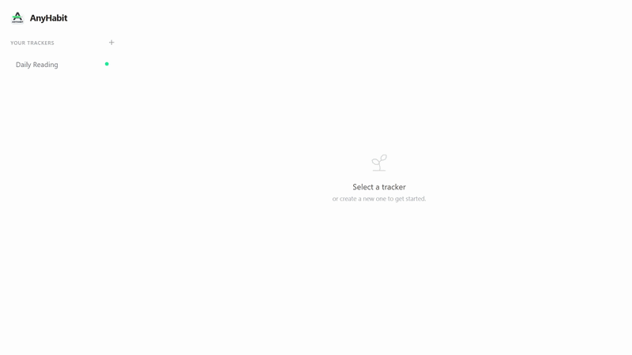

#  AnyHabit

[](https://fastapi.tiangolo.com/)
[](https://react.dev/)
[](https://tailwindcss.com/)
[](https://www.sqlite.org/)
[](https://www.docker.com/)
[](https://discord.gg/ajknBq5zcH)
[](https://sparths.github.io/anyhabit-demo/)

**AnyHabit** is a streamlined, universal habit-tracking dashboard designed for **Raspberry Pi**, home servers, and **Docker** enthusiasts. It provides a minimalist interface to track positive growth or systematically reduce harmful routines.

---

## 📺 Preview & Updates

> [!IMPORTANT]  
> **Try it now:** [Explore the Live Demo Site](https://sparths.github.io/anyhabit-demo/)  
> **Join the Community:** [AnyHabit Discord Server](https://discord.gg/ajknBq5zcH) — Get support, showcase your work, and chat with fellow devs!



<details>
<summary><b>🚀 Click to see Recent Updates (Changelog)</b></summary>

#### [v0.9.0] - Latest Release
- **Added:** Homepage Widgets
- [Full Changelog](https://github.com/Sparths/AnyHabit/compare/v0.8.0...v0.9.0)

#### [v0.8.0] - Habit Scheduling
- **Added:** Flexible Habit Scheduling
- [Full Changelog](https://github.com/Sparths/AnyHabit/compare/v0.7.0...v0.8.0)

#### [v0.7.0] - Refactor App Structure
- **Added:** Refactor app structure, Fix Bugs
- [Full Changelog](https://github.com/Sparths/AnyHabit/compare/v0.6.3...v0.7.0)

#### [v0.6.3] - Date Selection
- **Added:** Date Selection for "Build" Trackers Logs
- [Full Changelog](https://github.com/Sparths/AnyHabit/compare/v0.6.2...v0.6.3)

#### [v0.6.2] - Historical Progress
- **Added:** Historical Progress/Heatmap
- [Full Changelog](https://github.com/Sparths/AnyHabit/compare/v0.6.1...v0.6.2)

#### [v0.6.1] - Mobile Support
- **Added:** Better Mobile Layout
- [Full Changelog](https://github.com/Sparths/AnyHabit/compare/v0.6.0...v0.6.1)

#### [v0.6.0] - Relapse Feature
- **Added:** Add Relapse Feature that resets your Tracker without having to delete the whole tracker and loosing all Journal Entries
- **Fix:** Changed that Impact Units go up based on actual units logged.
- [Full Changelog](https://github.com/Sparths/AnyHabit/compare/v0.5.0...v0.6.0)
  
#### [v0.5.0] - Custom Impact Units
- **Added:** Support custom impact units!
- [Full Changelog](https://github.com/Sparths/AnyHabit/compare/v0.4.0...v0.5.0)
</details>

---

## ✨ Key Features

* **Dual Tracking Modes:** Monitor positive routines or reduce harmful ones.
* **Categories:** Organize your dashboard with custom categories.
* **Dark Mode:** Seamlessly switch between Light and Dark themes.
* **Impact Units:** Automatically calculate money/Calories and more by avoiding negative habits.
* **Daily Journal:** Log your mood and thoughts alongside your habits.
* **Self-Hosted & Private:** Complete control over your data with SQLite and Docker.

---

## 🚀 One-Command Quick Start

AnyHabit is designed to be "up and running" in seconds. You do **not** need Node.js or Python installed locally.

**Requirements:** [Docker](https://docs.docker.com/get-docker/) with the Compose plugin.

```bash
# 1. Clone the repository
git clone https://github.com/Sparths/AnyHabit.git
cd AnyHabit

# 2. Build and start everything
docker compose up -d --build
```

Open **http://localhost** (or your device's IP) in your browser.

> [!TIP]
> Your data is safely stored in a Docker volume (`db_data`) and will persist even if you stop or rebuild the containers.

---

## ⚙️ Configuration

| Variable | Description | Default |
| :--- | :--- | :--- |
| `APP_PORT` | The port on which the app is accessible | `80` |
| `VITE_API_URL` | Backend URL (internal routing) | `http://localhost/api` |

**To change the port:**
1. Create an environment file: `cp .env.example .env`
2. Edit `.env` and change `APP_PORT=8080`
3. Restart: `docker compose up -d`

---

## 🛠️ Tech Stack

* **Backend:** [FastAPI](https://fastapi.tiangolo.com/) (Python 3.12-slim)
* **Frontend:** [React 19](https://react.dev/) + [Vite](https://vitejs.dev/)
* **Styling:** [Tailwind CSS 4](https://tailwindcss.com/)
* **Proxy:** [Nginx](https://www.nginx.com/) as a Reverse Proxy & Static File Server

---

## 🤝 Community & Contributing

AnyHabit is an open-source, community-driven project! 

Join our **[Discord Server](https://discord.gg/ajknBq5zcH)** to:
* 🛠️ Get help with your setup or projects.
* 🚀 Showcase what you've built.
* 💬 Chat with other programmers and contributors.

**Other ways to help:**
* **💡 Ideas:** [Open a Feature Request](https://github.com/Sparths/AnyHabit/issues)
* **🐛 Bugs:** [Open a Bug Report](https://github.com/Sparths/AnyHabit/issues)
* **💻 Code:** Check our [Contributing Guidelines](CONTRIBUTING.md)

## ⭐ Star History

<a href="https://www.star-history.com/?repos=Sparths%2FAnyHabit&type=date&legend=top-left">
 <picture>
   <source media="(prefers-color-scheme: dark)" srcset="https://api.star-history.com/chart?repos=Sparths/AnyHabit&type=date&theme=dark&legend=top-left" />
   <source media="(prefers-color-scheme: light)" srcset="https://api.star-history.com/chart?repos=Sparths/AnyHabit&type=date&legend=top-left" />
   
 </picture>
</a>
