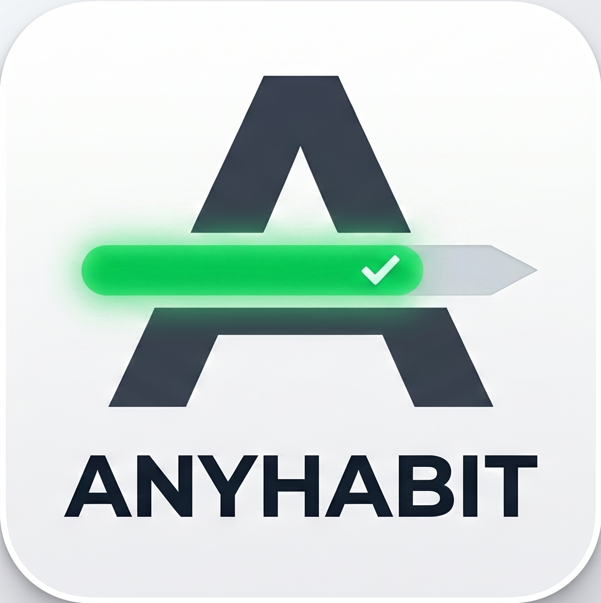

#  AnyHabit

[](https://fastapi.tiangolo.com/)
[](https://react.dev/)
[](https://tailwindcss.com/)
[](https://www.sqlite.org/)

**AnyHabit** is a universal habit-tracking dashboard tailored for **Raspberry Pi** and **Docker** environments. It helps you build positive habits or systematically quit harmful routines.

---

## 📸 Preview

<p align="center">
  
  <br>
  <em>Modern, minimalist design for maximum productivity.</em>
</p>

---

## 🚀 Quick Start

First, clone the repository:

```bash
git clone https://github.com/Sparths/AnyHabit.git
cd AnyHabit
```

### Docker (recommended — Raspberry Pi, home server, …)

**Requirements:** [Docker](https://docs.docker.com/get-docker/) with the Compose plugin.

```bash
# (Optional) pick a custom port
cp .env.example .env
# edit .env and set APP_PORT=8080   (or any port you like)

# Build & start
docker compose up -d --build
```

Open **http://localhost** (or `http://<raspberry-pi-ip>`) in your browser.

> Your data is stored in a named Docker volume (`db_data`) and survives container restarts.

#### Custom port example
```bash
APP_PORT=8080 docker compose up -d --build
# → app available at http://localhost:8080
```

#### Stopping / updating
```bash
docker compose down           # stop
docker compose up -d --build  # rebuild and restart
```

---

### Local Development

**Requirements:** Python 3.11+, Node.js 18+

**Backend** (from the repo root)
```bash
pip install -r backend/requirements.txt
mkdir -p backend/data
uvicorn backend.main:app --reload --host 0.0.0.0 --port 8000
# API docs: http://localhost:8000/docs
```

**Frontend** (in a separate terminal)
```bash
cd frontend
npm install
VITE_API_URL=http://localhost:8000 npm run dev
# UI: http://localhost:5173
```

---
